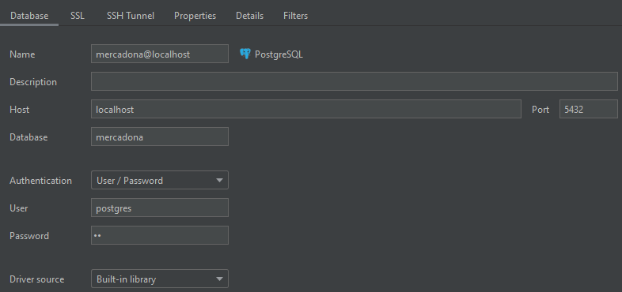

# Spring Boot API CRUD Mercadona exam App

## About
The following repo contains a Spring Boot API App that acts as a service to monitor products with CRUD operations. 

## Download the app:
### with Docker:
```
docker pull truricprd/mercadona:version2
```
### with Git:
```
git init
git pull https://github.com/truric/mercadona-exam.git
```
### no Git not Docker:
```
https://github.com/truric/mercadona-exam/archive/refs/heads/main.zip
```

## Run the app with no Docker:
* Create a PostgreSQL Database with name: mercadona
* Set up your DB Browser settings to look like this, where the password is "wm", as seen on applications.properties:


* Run all the tests at once to populate database with table and products records

* You can now run the app

## API endpoints:
* Using an API platform like Postman or Insomnia, you can test the following endpoints:


* Get all products:
```
http://localhost:8080/api/v1/products
```
* Post a new product:
```
http://localhost:8080/api/v1/products

add Json body to create a new product, example:

{
	"name": "name of the product",
	"price": 99.00,
	"quantity": 50,
	"weight": 1.0,
	"weightFormat": "kg",
	"thumbnail": "www.mercadona.es/product-name/thumbnail/123"
}
```
* Put existing product:
```
http://localhost:8080/api/v1/products/2

add Json body to add changes to an existing product, example:

{
	"name": "change name of the existing product",
	"price": 89.00,
	"quantity": 49,
	"weight": 2.0,
	"weightFormat": "l",
	"thumbnail": "www.mercadona.es/product-name/thumbnail/101"
}
```
* Delete existing product:
```
http://localhost:8080/api/v1/products/2
```

### About
* In order to make the response requests user-friendly, instead of using a conditional approach or surrounding every request with try catch, I've used Java Beans Validator which adds rules to properties and returns error messages to the User.
* To aid in this regard, I've created ValidationConstraintHandler, which intercepts exceptions, so we can customize error messages. It also formats the response request on errors with timestamp, status code and a personalized message from the Controller
* On the Controller, the personalized error messages are sent with the help of ResourceNotFoundException, and the successful messages are sent with ResponseEntity body.
* I've used a BDD approach, whereas everything was tested and every test must pass first in order to move on to the next step

## Docker

### Extract new Docker image:
* run Docker on your machine
* get on Application path
```
example:
cd Desktop/product-CRUD-API
```
* create a Docker image:
```
docker build -t docker-image-name-here .
```

### Some Docker commands:
* run the app as a container
```
docker run -p 8080:8080 docker-image-name-here
```
* or run it as detached mode
```
docker run -dp 80:8080 docker-image-name-here
```
* enter the running container
```
docker exec -it app-name-here /bin/bash
```

### Push this image to your Docker Hub
* login to Docker Hub to push this image
```
login -u user-name-here
```
* check docker images to check the correct name
```
docker images
```
* use the command tag to name the image, the output name must have this syntax: docker-user-name/new-image-name:version-number, version number is optional
```
docker tag docker-image-name-here docker-user-name/new-iname-name:version1
```
* push the image to your Docker Hub
```
docker push docker-user-name/new-iname-name:version1
```